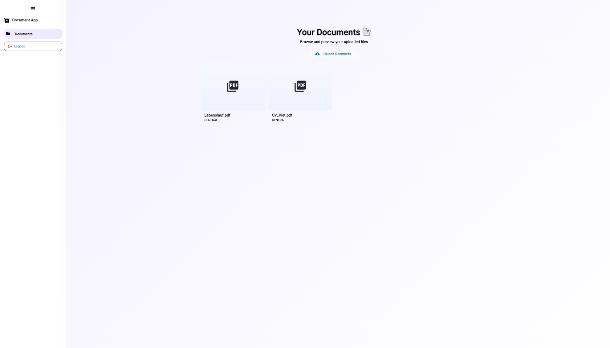

# 📄 Document Analyzer

**Document Analyzer** is a production-grade, full-stack document management and analysis platform built with **Java 21**, **Spring Boot 3**, **Angular 19 SSR**, and **Azure AI services**.

It provides RESTful APIs and modern UI for document upload, AI-powered analysis, and intelligent search capabilities.

---

## ✨ Features

### 🔐 Authentication & Security
- **JWT-based authentication** with access and refresh tokens
- **Spring Security** integration with role-based access control
- **Keycloak** support for enterprise SSO
- **BCrypt** password encryption

### 📁 Document Management
- Upload documents (PDF, DOCX, JPG, PNG, etc.)
- Automatic image-to-PDF conversion using Apache PDFBox
- Dual storage support: Local filesystem or Azure Blob Storage
- View, download, and delete documents
- Search documents by name and type
- Retrieve all documents for authenticated users

### 🤖 AI-Powered Analysis
- **Azure Document Intelligence (Form Recognizer)** integration
- Extract structured data from invoices, receipts, and contracts
- Automated document processing workflows
- JSON result storage for analysis history

### 🔍 Search & Discovery
- Basic text-based document search
- Ready for Azure Cognitive Search integration
- Semantic search capabilities (optional)

---

## 🛠️ Tech Stack

### Backend
- **Java 21** with modern features
- **Spring Boot 3.1.5** (Web, Security, Data JPA, Actuator)
- **MySQL 8.0** with Flyway migrations
- **Apache PDFBox 3.0** for PDF processing (replaced iText for license safety)
- **JWT (jjwt 0.12)** for authentication
- **Azure SDK** (Blob Storage, Form Recognizer)
- **Maven** for dependency management

### Frontend
- **Angular 19** with Server-Side Rendering (SSR)
- **Node.js 20** runtime
- **TypeScript** for type safety
- **Tailwind CSS** for styling
- **RxJS** for reactive programming

### Infrastructure
- **Docker** & **Docker Compose** for containerization
- **Keycloak 26** for authentication server
- **MySQL 8.0** for persistence
- **Azure Cloud** services integration

---

## 🚀 Getting Started

### Prerequisites
- **Java 21** or higher
- **Node.js 20** or higher
- **Maven 3.x**
- **Docker** and **Docker Compose** (optional, for containerized deployment)
- **Azure account** (optional, for cloud features)

### Quick Start with Docker Compose

1. **Clone the repository**
   ```bash
   git clone https://github.com/quocvietphung/document-analyzer.git
   cd document-analyzer
   ```

2. **Create environment file**
   ```bash
   cp .env.example .env
   # Edit .env with your configuration
   ```

3. **Start all services**
   ```bash
   docker compose -f docker-compose.full.yml up -d
   ```

4. **Access the applications**
   - Frontend: [http://localhost:4200](http://localhost:4200)
   - Backend API: [http://localhost:8080](http://localhost:8080)
   - Keycloak Admin: [http://localhost:8081](http://localhost:8081)

### Local Development Setup

#### Backend Setup

1. **Configure database**
   ```bash
   # Create MySQL database
   mysql -u root -p
   CREATE DATABASE documents;
   ```

2. **Set environment variables**
   ```bash
   export DB_HOST=localhost
   export DB_USERNAME=root
   export DB_PASSWORD=your-password
   export JWT_SECRET=your-secret-key-min-256-bits
   ```

3. **Build and run**
   ```bash
   mvn clean install
   mvn spring-boot:run
   ```

   Backend runs at: [http://localhost:8080](http://localhost:8080)

#### Frontend Setup

1. **Install dependencies**
   ```bash
   cd frontend
   npm install
   ```

2. **Run development server**
   ```bash
   npm start
   ```

   Frontend runs at: [http://localhost:4200](http://localhost:4200)

3. **Build for production with SSR**
   ```bash
   npm run build
   npm run serve:ssr:frontend
   ```

---

## 📌 API Endpoints

### Authentication API
| Method | Endpoint               | Description                    | Auth Required |
|--------|------------------------|--------------------------------|---------------|
| POST   | `/api/auth/login`      | Login with email/password      | No            |
| POST   | `/api/auth/refresh`    | Refresh access token           | No            |
| GET    | `/api/auth/validate`   | Validate current token         | Yes           |

### User API
| Method | Endpoint               | Description               | Auth Required |
|--------|------------------------|---------------------------|---------------|
| POST   | `/api/users/create`    | Create a new user         | No            |
| POST   | `/api/users/login`     | Login (legacy endpoint)   | No            |
| GET    | `/api/users`           | List all users            | Yes           |
| GET    | `/api/users/{id}`      | Get user by ID            | Yes           |
| PUT    | `/api/users/{id}`      | Update user details       | Yes           |

### Document API
| Method | Endpoint                          | Description                      | Auth Required |
|--------|-----------------------------------|----------------------------------|---------------|
| POST   | `/api/documents/upload`           | Upload a document                | Yes           |
| GET    | `/api/documents/getUserDocuments` | List user's documents            | Yes           |
| GET    | `/api/documents/{id}`             | Get document metadata            | Yes           |
| GET    | `/api/documents/{id}/view`        | View or download document        | Yes           |
| POST   | `/api/documents/{id}/process`     | Process document with Azure AI   | Yes           |
| DELETE | `/api/documents/{id}`             | Delete a document                | Yes           |
| POST   | `/api/documents/analyze`          | Analyze document (direct upload) | Yes           |
| GET    | `/api/documents/search?q=`        | Search documents                 | Yes           |

### Health & Monitoring
| Method | Endpoint               | Description               |
|--------|------------------------|---------------------------|
| GET    | `/actuator/health`     | Application health status |
| GET    | `/actuator/info`       | Application information   |
| GET    | `/actuator/metrics`    | Application metrics       |

---

## 🔧 Configuration

### Environment Variables

All sensitive configuration is managed through environment variables. See `.env.example` for a complete list.

**Key configurations:**

```bash
# Database
DB_HOST=localhost
DB_NAME=documents
DB_USERNAME=root
DB_PASSWORD=changeme

# JWT Security
JWT_SECRET=your-secret-key-min-256-bits
JWT_EXPIRATION_MS=3600000

# Azure Services (Optional)
AZURE_FORM_RECOGNIZER_ENDPOINT=https://your-resource.cognitiveservices.azure.com/
AZURE_FORM_RECOGNIZER_KEY=your-key
AZURE_STORAGE_ACCOUNT_NAME=your-storage-account
AZURE_STORAGE_ACCOUNT_KEY=your-storage-key
```

### Storage Options

The application supports two storage modes:

1. **Local Storage** (Default)
   - Files stored in `./uploads` directory
   - No additional configuration needed
   - Suitable for development and testing

2. **Azure Blob Storage** (Production)
   - Requires Azure Storage account
   - Automatic fallback to local storage if Azure is unavailable
   - Set `AZURE_STORAGE_ACCOUNT_NAME` and `AZURE_STORAGE_ACCOUNT_KEY`

---

## 🧪 Testing

### Backend Tests
```bash
mvn test
```

### Frontend Tests
```bash
cd frontend
npm test
```

---

## 📦 Building for Production

### Backend JAR
```bash
mvn clean package -DskipTests
# Output: target/document-analyzer-1.0.1-SNAPSHOT.jar
```

### Frontend Production Build
```bash
cd frontend
npm run build
# Output: dist/frontend/
```

### Docker Images
```bash
# Backend
docker build -t document-analyzer-backend .

# Frontend
docker build -t document-analyzer-frontend ./frontend
```

---

## 🐳 Docker Deployment

### Full Stack Deployment
```bash
docker compose -f docker-compose.full.yml up -d
```

This starts:
- MySQL database
- Keycloak authentication server
- Backend Spring Boot application
- Frontend Angular SSR application

### Individual Services
```bash
# Start only backend and database
docker compose -f docker-compose.full.yml up -d mysql backend

# View logs
docker compose -f docker-compose.full.yml logs -f backend

# Stop all services
docker compose -f docker-compose.full.yml down
```

---

## 🏗️ Project Structure

```
document-analyzer/
├── src/main/java/ai/document/analyzer/
│   ├── config/          # Configuration classes
│   ├── controller/      # REST controllers
│   ├── dto/             # Data Transfer Objects
│   ├── model/           # JPA entities
│   ├── repository/      # Data repositories
│   ├── security/        # Security & JWT utilities
│   ├── service/         # Business logic services
│   └── MainApplication.java
├── src/main/resources/
│   ├── application.yml  # Application configuration
│   └── db/migration/    # Flyway database migrations
├── frontend/
│   ├── src/app/         # Angular application
│   ├── Dockerfile       # Frontend Docker image
│   └── package.json     # npm dependencies
├── .env.example         # Example environment variables
├── Dockerfile           # Backend Docker image
├── docker-compose.full.yml  # Full stack deployment
├── pom.xml              # Maven configuration
└── README.md
```

---

## 🔐 Security Features

- ✅ JWT-based stateless authentication
- ✅ Password encryption with BCrypt
- ✅ CORS configuration
- ✅ SQL injection prevention via JPA
- ✅ No hardcoded secrets
- ✅ Secure HTTP headers
- ✅ Role-based access control
- ✅ Token expiration and refresh

---

## 🚧 Roadmap

- [ ] Azure Cognitive Search integration
- [ ] OpenAI embeddings for semantic search
- [ ] Advanced document processing workflows
- [ ] Webhook support for async processing
- [ ] Multi-tenant support
- [ ] Document versioning
- [ ] Batch upload and processing
- [ ] Advanced analytics dashboard

---

## 📄 License

This project is licensed under the MIT License.

---

## 👥 Contributing

Contributions are welcome! Please feel free to submit a Pull Request.

---

## 📞 Support

For issues and questions, please open an issue on GitHub.

---

## 🎯 Demo

Check out the demo UI for document management capabilities:

